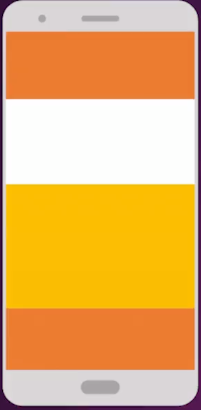

# Curso Básico de Diseño de Interfaces con Android Studio

Created: August 18, 2023 11:08 PM
Last Edited Time: August 21, 2023 6:50 PM
Type: Android
Status: In Progress 🙌
Created By: Hernán Velásquez
Last Edited By: Hernán Velásquez
Platform: Platzi
Topic: Android
Mode: Priority
Instructor: Sinuhé Jaime Valencia

# ****Curso Básico de Diseño de Interfaces con Android Studio****

## Tabla de Contenido

# **Introducción**

## Repositorio del curso

[GitHub - sierisimo/Android-Interfaces-PlatziMusic at 04-constraintlayout](https://github.com/sierisimo/Android-Interfaces-PlatziMusic/tree/04-constraintlayout)

## ****UI en Android: ¿Por qué? ¿Cómo?****

**XML**(eXtensible Markup Language):

Es un lenguaje de etiquetas, es decir, cada paquete de información está delimitado por dos ***etiquetas/tags***

Como se hace también en el lenguaje HTML, pero XML separa el contenido de la presentación.

```xml
<H1>Hernan</H1> <--- HTML
<Nombre>Hernan</Nombre> <--- XML

```

`<H1`> y `<Nombre>` son etiquetas/tags. Ambas encierran el texto o paquete de información *Hernan*.

La etiqueta `<H1>` es de HTML, y se encarga de mostrar visualmente el texto *Hernan* en la página web en un tamaño determinado pero no dice nada del significado de Hernan: si es una ciudad o un nombre, por ejemplo.

En cambio la etiqueta `<Nombre>` es de XML y nos dice que *Hernan* es un nombre de persona,

Por lo tanto XML se preocupa del significado del texto que encierra y no de la apariencia de cómo se muestre el texto en la página web.

Por eso se dice que XML es un lenguaje de etiquetas, que como hemos dicho anteriormente, separa el contenido de la presentación.

Los **tags** (*etiquetas*) pueden tener **atributos**, que son una manera de incorporar características o propiedades a las etiquetas de un documento.

El atributo **consta de dos partes**: La **propiedad** del elemento y el **valor** de la propiedad,

que siempre va entre comillas doble (“) o simple (‘).

```xml
<TAG atributo="valor">
    Contenido
</TAG>

<TAG-2 atributo="valor"/>

```

Ejemplo practico:

```xml
<Datos-Nacimiento>
    <Persona>
       <Nombre>Hernan</Nombre>
       <Fecha>15.10.2012</Fecha>
       <Ciudad>Madrid</Ciudad>
       <Peso>3.1Kg</Peso>
       <Estatura>45cm</Estatura>
    </Persona>
    <Persona>
       <Nombre>Maribel</Nombre>
       <Fecha>11.09.2012</Fecha>
       <Ciudad>Sevilla</Ciudad>
       <Peso>3Kg</Peso>
       <Estatura>40cm</Estatura>
    </Persona>
</Datos-Nacimiento>

```

- **`namespaces`**: es una forma de dar un *contexto* (scope), a un tag. Es definir donde un elemento tiene un valor definido. En otras palabras, es un medio para organizar clases dentro de un entorno, agrupándolas de un modo más lógico y jerárquico.

Ejemplo:

En Android veremos mucho el ***`namespace`*** de Androdid en la siguiente forma:

```xml
<NAMESPACE:TAG atr="val">
    Contenido
</NAMESPACE:TAG>

```

```xml
<Profesor:Luis
    trabajo:horario="9-11"
    trabajo:email="luisprof@uni.com"
    persona:id="@user9283">
</Profesor:Luis>

```

```xml
<TextView android:text="Hola mundo" />

```

*¿Pero como saber de donde proviene un `namespace`?*

Con la palabra reservada `xmlns` y con un URI/dirección que hará a entender de donde un xml tiene su procedencia, de esa manera xml va a poder entender cuando un valor tiene o no tiene un contexto y cuando puede darle o asignarle un comportamiento.

Siguiendo el ejemplo anterior:

```xml
<... xmlns:android="http://schemas.android.com/apk/res/android"/>

```

`android` es un alias asignado por nosotros. Podemos ver esto como una forma de encapsular otra etiqueta dentro una clase *Android*.

# **Revisando los archivos para una UI**

## ****Instalando Android Studio****

[Download Android Studio & App Tools - Android Developers](https://developer.android.com/studio)

## ****Enlazando nuestro layout con el código****

**Estructura de res:**

- `drawable`: Representa gráficos (Todo aquello que pueda ser dibujado en una pantalla).
- `layout`: Representa todas las estructuras de pantallas que creemos.
- `mipmap`: Aquí guardaremos iconos.
- `values`: Aquí administraremos los recursos (Colores, cadenas, dimensiones o arreglos).
- 📄 colors.xml: Colores
- 📄 strings.xml: Textos
- 📄 styles.xml: Temas
- 📄 dimens.xml: Dimensiones

**Recursos más complejos:**

- `font`: Aquí guardaremos las fuentes de la aplicación.
- `anim`: Contendrá xml para animaciones.
- `xml`: Contendrá preferencias de usuario y datos más complejos.
- raw: Contendrá archivos como vídeos o audios.

# **Creando una UI**

## ****La vista de diseño en Android Studio****

La vista de texto en Android Studio Cuando se tiene definido un layout y damos doble clic nos abre la vista de diseño, desde aquí podemos seleccionar sobre qué dispositivo queremos diseñar o sobre qué versión de Android. También tiene una sección llamada Palette, desde la que podremos arrastrar elementos de interfaz que ya están incluidos en Android a nuestro diseño.

## ****La clase R****

La clasew R, nos permite conectar los recursos de la carpeta `res` con las clases o scrips de Kotlin.

Cuando compilas tu aplicación, cada archivo de diseño XML se compila en un recurso `View`.

Debes cargar el recurso de diseño desde el código de tu aplicación, en la implementación de devolución de llamada `Activity.onCreate()`.

Para eso, llama a `setContentView()` pasando la referencia a tu recurso de diseño en forma de `R.layout.layout_file_name.`

Por ejemplo, mirando el diseño XML *activity_main.xml* que nos crea Android Studio al crear un *empty project*,

para poder cargarlo en nuestra actividad lo hariamos de la siguiente manera:

```kotlin
class MainActivity : ComponentActivity() {
    override fun onCreate(savedInstanceState: Bundle?) {
        super.onCreate(savedInstanceState)

        setContentView(R.layout.activity_profile)

        val color = R.color.purple_200
        val colo2 = R.color.purple_700

        val name = R.string.app_name
    }
}
```

# **Widgets y Vistas**

## ****ViewGroup y View: Diferencias básicas****

- **View**: es un elemento que se va a mostrar por pantalla así como tal.
    - TextView
    - ImageView
    - EditText
- **ViewGroup**: es un elemento que sirve para agrupar elementos. Nota: cuando tenemos un grupo de elementos dentro de un ViewGroup, los cambios que hagamos sobre este afectaran los elementos dentro de el.Ejemplo:Si cambiamos el **atributo** `gravity="center"`, todos los elementos se moverán al centro de la pantalla.

    ```xml
    <LinearLayout android:gravity="start"
    	<TextView />
    	<ImageView />
    	<EditText />
    </LinearLayout>
    ```


Si cambiamos el **atributo** `gravity="center"`, todos los elementos se moverán al centro de la pantalla.

podemos poner mas de un valor para el atributo usaondo el separador `|`, Ejemplo:

`android:gravity="end |center"`

## ****Atributos importantes: alto, ancho y id****

`android:layout_width`,`android:layout_height`: nos permiten especificar el ancho y la altura con medidas exactas,

aunque probablemente no quieras hacerlo con mucha frecuencia.

Generalmente, usarás una de estas constantes para establecer el ancho o la altura:

- **wrap_content**: indica a tu vista que modifique su tamaño conforme a los requisitos de este contenido.
- **match_parent** indica a tu vista que se agrande tanto como lo permita su grupo de vistas principal.

En general, no se recomienda especificar el ancho ni la altura de un diseño con unidades absolutas como píxeles. En cambio, el uso de medidas relativas como unidades de píxeles independientes de densidad (**dp**), **wrap_content**

o **match_parent** es un mejor enfoque, ya que ayuda a garantizar que tu aplicación se muestre correctamente en dispositivos con pantallas de diferentes tamaños.

Con el `@` podemos hacer referencia  a recursos, como colores, imagenes, entre otros.

```xml
<TextView
            android:layout_width="match_parent"
            android:layout_height="wrap_content"
            android:background="@color/myFavoryColor"
            android:textColor="@color/purple_200"
            android:text="@string/main_activity_saludo" />

    <EditText
            android:layout_width="wrap_content"
            android:layout_height="wrap_content"
            android:hint="@string/profile_activity_escribe_nombre" />
```

## ****Otros atributos y el namespace tools****

### `android:id`

Cualquier objeto **View** puede tener un **ID** entero asociado para identificarse de forma única dentro del árbol.

Cuando se compila la aplicación, se hace referencia a este ID como un número entero, pero el ID se asigna normalmente en el archivo XML de diseño como una *string* del atributo id.

Este es un atributo XML común para todos los objetos View (definido por la clase View) y lo utilizarás muy a menudo.

La sintaxis de un ID dentro de una etiqueta XML es la siguiente: `android:id="@+id/my_button"`

desde Kotlin podemos llamar esos elementos usando su id, de la siguiente manera: `R.id.tvMainSaludo`

### Atributos específicos y atributos compartidos

Existen atributos compartidos y otros específicos para cada elemento.

Por ejemplo, el atributo `android:background`, que nos permite establecer un color, es un atributo que existe para todos los elementos de `android`; el atributo `android:hint="Enter password"` es un atributo especifico de la View `EditText`

### Namespace tools

Si en algún momento no quieres utilizar un atributo especifico y quieres solamente utilizarlo en tiempo de diseño para poder ver como se vería, existe un namespace denominado **tools**.

Es un namespace que nos permite ver en tiempo de diseño como se verá nuestra aplicación sin generar una versión final de la aplicación con esos valores.

Por ejemplo, si se establece el valor del atributo `android:text` durante el tiempo de ejecución o si quieres ver el diseño con un valor diferente del valor predeterminado, puedes agregar `tools:text` para especificar texto solo para la vista previa de diseño.

```xml
<TextView
            android:id="@+id/tvMainSaludo2"
            android:layout_width="match_parent"
            android:layout_height="120dp"
            android:background="@color/purple_700"
            android:textColor="@color/purple_200"
            tools:background="@color/blue1"
            tools:text="Este es mi mensaje de prurba!"
            android:text="@string/main_activity_saludo" />
```

# **Layouts base**

## ****LinearLayout: Organizacion lineal****

| LinearLayout | LinearLayout |
| --- | --- |
| orientation=”vertical” | orientation=”horizontal” |

[https://www.notion.so](https://www.notion.so)




**Density Point:** Densidad de puntos(dp), esta es la unidad de medida para el tamaño de las imágenes. Android lo trabaja de una manera porcentual, de forma que es la máquina virtual de Android la que decide el tamaño de dicha imagen según los tamaños de pantalla de cada dispositivo.

**Layout_gravity**

Este elemento afecta solamente a los elementos en el que se declara. Se utiliza para dar una posición a los elementos dentro de la pantalla.

android:layout_gravity=“center”

**layout_margin**

Se utiliza para dar un contorno al elemento en el que se declara, por ejemplo se pueden declarar dentro de 2 EditText para separarlos uno del otro.

android:layout_margin=“12dp”

**drawablePadding**

Se utiliza para separar íconos y texto que yacen dentro de un mismo view. Por ejemplo separar un ícono y el texto dentro de un EditText. Su unidad de medida es dp.

`android:drawablePadding="12dp"`

**drawableStart**

Esta línea de código funciona para declarar íconos dentro de un EditText. Recordar que para que esto sea posible, el ícono ya debe de estar dentro del directorio drawable.

`android:drawableStart="@drawable/vector_person"`

**<Space/>**

Se utiliza para separar elementos mediante “espacios”, de forma que ocupan un lugar de la pantalla pero sin ser visibles en pantalla.

```xml
<Space
    android:layout_width="match_parent"
    android:layout_height="0dp"
    android:layout_weight="1"/>

```

En este ejemplo de Space, se declararon los siguientes atributos:

**Layout_width=”match_parent”**  Esto hace que el espacio tome todo el ancho en el espacio que se le asignó

**Layout_height=”0dp”**  Esto inhabilita el height/altura, para dar continuidad al atributo weight

**Layout_weight=”1”**  Hace que el elemento que le sigue(puede ser un botón) se vaya hasta el fondo de la pantalla, de esta forma el espacio ocupa casi todo el espacio disponible en pantalla y así separando los EditText y el botón.

**<Button/>**

Esta etiqueta se utiliza para crear botones, dentro del mismo se pueden declarar los siguientes atributos:

```xml
android:layout_marginStart="12dp"
android:layout_marginEnd="12dp"
android:background="@color/colorPrimary"
android:text="@string/button_login"
android:layout_width="match_parent"
android:layout_height="wrap_content"

```

**layout_marginStart=”12dp”**  se utilizó para dar un espacio entre el borde izquierdo de la pantalla y el botón.

**layout_marginEnd=”12dp”**  se utilizó para dar un espacio entre el borde derecho de la pantalla y el botón.

**Background**  color de fondo, traído desde el archivo colors.xml

**Text**  texto dentro del botón, importado del archivo Strings.xml

Width y height  tamaño del botón

```xml
<?xml version="1.0" encoding="utf-8"?>
<LinearLayout xmlns:android="http://schemas.android.com/apk/res/android"
        android:orientation="vertical"
        android:background="@android:color/white"
        android:layout_width="match_parent"
        android:layout_height="match_parent">

    <ImageView
            android:layout_width="160dp"
            android:layout_height="120dp"
            android:layout_gravity="center"
            android:src="@mipmap/logo" />

    <EditText
            android:layout_width="match_parent"
            android:layout_height="wrap_content"
            android:drawableStart="@drawable/vector_person_24"
            android:layout_margin="12dp"
            android:drawablePadding="12dp"
            android:hint="@string/hint_user" />

    <EditText
            android:layout_width="match_parent"
            android:layout_height="wrap_content"
            android:drawablePadding="12dp"
            android:layout_margin="12dp"
            android:drawableStart="@drawable/vector_password_24"
            android:hint="@string/hint_password" />

<!--            se asigna prioridad en el espacio que ocupa,
 es lo que llena el area entre el password y el boton"-->
    <Space
            android:layout_width="wrap_content"
            android:layout_height="0dp"
            android:layout_weight="1" />

    <Button
            android:layout_width="match_parent"
            android:layout_height="wrap_content"
						android:layout_margin="12dp"
            android:background="@color/colorPrimary"
            android:text="@string/button_login" />

</LinearLayout>
```

## ****RelativeLayout: organizando con referencias****


- Para que el elemento esté alineado arriba utilizamos
    - `layout_alingParentTop="true"`

- Si queremos que el elemento esté alineado abajo:
    - `layout_alingParentBottom="true"`
- Para que un elemento esté alineado hacia la izquierda:
    - `layout_alingParentStart="true"`

- Para que se pueda alinear a la derecha:
    - `layout_alingParentEnd="true"`

- Si queremos que un elemento esté alineado con respecto a otro elemento primero indicamos su posición y le indicamos el elemento con el que queremos que esté alineado:
    - `layout_alingParentEnd="true"`
      `layout_below="@id/imagen"`
      este codigo sirve para alinearel objetos a la derecha con respecto al elemento imagen

- Si lo que buscamos es que un elemento nos ocupe todo el ancho de la pantalla, `RelativeLayout` está pensado para eso, porque nosotros le podemos indicar la alineación inicial y final que debería tener en la pantalla.
    - `layout_alingParentStart="true"`
      `layout_alingParentEnd="true"`

Le estamos diciendo que el objeto esté alineado a la izquierda y derecha de la pantalla, de esta manera ocupará todo el ancho del activity.


## ****RelativeLayout: Uso práctico****

RelativeLayout tiene la ventaja que te permite generar vistas usando menos viewgroups para estructurarlas. haciendo el arbol jerarquico menos pesado. No es necesario crewar `space` para llenar el área vacia.

RelativeLayout nos permite hacer responsive el diseño de nuestros elementos en pantalla.

```xml
<?xml version="1.0" encoding="utf-8"?>
<RelativeLayout xmlns:android="http://schemas.android.com/apk/res/android"
        android:background="@android:color/white"
        android:layout_width="match_parent"
        android:layout_height="match_parent">

    <ImageView
            android:id="@+id/ivLoginLogo"
            android:layout_width="160dp"
            android:layout_height="120dp"
            android:layout_alignParentTop="true"
            android:layout_centerHorizontal="true"
            android:src="@mipmap/logo" />

    <EditText
            android:id="@+id/etLoginUserName"
            android:layout_width="0dp"
            android:layout_height="wrap_content"
            android:layout_below="@id/ivLoginLogo"
            android:layout_alignParentStart="true"
            android:layout_alignParentEnd="true"
            android:drawableStart="@drawable/vector_person_24"
            android:layout_margin="12dp"
            android:drawablePadding="12dp"
            android:hint="@string/hint_user" />

    <EditText
            android:id="@+id/etLoginPassword"
            android:layout_width="match_parent"
            android:layout_height="wrap_content"
            android:layout_below="@id/etLoginUserName"
            android:drawablePadding="12dp"
            android:layout_margin="12dp"
            android:drawableStart="@drawable/vector_password_24"
            android:hint="@string/hint_password"
            android:autofillHints="" />

    <Button
            android:layout_width="0dp"
            android:layout_height="wrap_content"
            android:layout_alignParentBottom="true"
            android:layout_alignParentStart="true"
            android:layout_alignParentEnd="true"
            android:layout_margin="12dp"
            android:background="@color/colorPrimary"
            android:text="@string/button_login" />

</RelativeLayout>
```

## ****FrameLayout: Alineación por region****

Hasta ahora los layouts que hemos visto (Linear y Relative) han abarcado toda la pantalla a la hora de implementarlos, y en ocasiones será necesario solo usar una parte de esta.

Con FrameLayout podemos ocupar una región de la pantalla basándonos en el elemento más grande dentro de esa región. Es decir, el FrameLayout va a crecer tanto como lo indiquemos (match parent, wrap content).

Otro uso común de FrameLayout es que podemos cargar vistas dinámicamente en él. También nos da versatilidad a la hora de poner elementos, ya que pone un elemento frente al otro con los que se pueden crear diferentes efectos.

Con FrameLayout podemos organizar vistas unas sobre otras como si fueran capas y ajustar sus atributos layout_gravity para que tomen la posición que indique nuestro diseño. También podemos agregar vistas dinámicas.

- `LinearLayout` - Secuencia en bloques
- `RelativeLayout` - Responsivo
- `FrameLayout` - por tamaño maximo.

## ****FrameLayout: Uso práctico****

El framelayout normalmente se utiliza para tener solo un elemento el cual podras sustituir como una imagen, si pones mas vistas estan se iran superponiendo como una pila de capas,donde la mas reciente agregada se vera primero , asi que algunos lo usan para sus placeholder. otros para mostrar un elemento encima de otro, por las capas. pero no es usado para diseñar toda una interfaz, como el login, imaginate poner margin o gravity a todo.

```xml
<?xml version="1.0" encoding="utf-8"?>
<LinearLayout xmlns:android="http://schemas.android.com/apk/res/android"
        android:orientation="vertical"
        android:background="@android:color/white"
        android:layout_width="match_parent"
        android:layout_height="match_parent">

    <ImageView
            android:layout_width="160dp"
            android:layout_height="120dp"
            android:layout_gravity="center"
            android:src="@mipmap/logo" />

    <EditText
            android:layout_width="match_parent"
            android:layout_height="wrap_content"
            android:drawableStart="@drawable/vector_person_24"
            android:layout_margin="12dp"
            android:drawablePadding="12dp"
            android:hint="@string/hint_user" />

    <EditText
            android:layout_width="match_parent"
            android:layout_height="wrap_content"
            android:drawablePadding="12dp"
            android:layout_margin="12dp"
            android:drawableStart="@drawable/vector_password_24"
            android:hint="@string/hint_password" />

    <Space
            android:layout_width="wrap_content"
            android:layout_height="0dp"
            android:layout_weight="1" />

    <Button
            android:layout_width="match_parent"
            android:layout_height="wrap_content"
            android:layout_margin="12dp"
            android:background="@color/colorPrimary"
            android:text="@string/button_login" />

</LinearLayout>
```

## ****Layouts externos: ConstraintLayout****

Es un layout externo similar a RelativeLayout con la excepción de que en ConstraintLayout los elementos reaccionan a las modificaciones que ocurran en la pantalla. Es un Layout muy usado, tanto que es cuando se crea una nueva Activity es el tipo de Layout por default, de hecho ya se encuentra agregado por defecto en las dependencias.

ConstraintLayout tiene algunas ventajas como:

- Facilita el hacer animaciones
- Permite agregar elementos más dinámicos que reaccionen a cambios en el ancho de la pantalla, etc.
- Es más flexible que otros tipo de layouts pues permite establecer relaciones entre todos los elementos y la propia vista padre.
- Mejora el uso de la memoria al evitar usar layouts anidados para generar interfaces complejas

ConstraintLayout usa un namespace llamado `app` para estructurar la pantalla.

Cada uno de los círculos de la imagen representan los puntos sobre los que se puede alinear cada elemento. Dichos puntos son *start*, *end*, *top*, *bottom*.


**Ejemplo:**

```xml
app:layout_constraintTop_toTopOf="parent" <!-- Alinea el Top del elemento conel Top del padre -->

```

**🛈 Nota:** todos los elementos de un ConstraintLayout deben tener por lo menos una alineación horizontal y vertical.

Una ventaja de este tipo de layout es que si ocurre un cambio en la pantalla, como por ejemplo que se quite un elemento, el elemento de abajo se va a alinear con respecto a los constraints que tenia el elemento previo, permitiendo así crear interfaces dinámicas.

El `ConstraintLayout` no hace el ordenamiento por si mismo. Por cada elemento que agreguemos, debemos decirle como alinearlo con respecto a otros elementos de la pantalla. Aunque si, podemos hacer cosas mas atractivas con este layout, tenemos que recordar que el como se organizan las cosas depende totalmente de nosotros.

```xml
<?xml version="1.0" encoding="utf-8"?>
<androidx.constraintlayout.widget.ConstraintLayout xmlns:android="http://schemas.android.com/apk/res/android"
        xmlns:app="http://schemas.android.com/apk/res-auto"
        android:background="@android:color/white"
        android:layout_width="match_parent"
        android:layout_height="match_parent">

    <ImageView
            app:layout_constraintTop_toTopOf="parent"
            app:layout_constraintStart_toStartOf="parent"
            app:layout_constraintEnd_toEndOf="parent"
            android:layout_width="160dp"
            android:id="@+id/ivLoginLogo"
            android:layout_height="120dp"
            android:src="@mipmap/logo" />

    <EditText
            app:layout_constraintTop_toBottomOf="@id/ivLoginLogo"
            app:layout_constraintStart_toStartOf="parent"
            app:layout_constraintEnd_toEndOf="parent"
            android:id="@+id/etLoginUserName"
            android:layout_width="0dp"
            android:layout_height="wrap_content"
            android:layout_margin="12dp"
            android:drawableStart="@drawable/vector_person_24"
            android:drawablePadding="12dp"
            android:hint="@string/hint_user" />

    <EditText
            app:layout_constraintTop_toBottomOf="@id/etLoginUserName"
            app:layout_constraintStart_toStartOf="parent"
            app:layout_constraintEnd_toEndOf="parent"
            android:id="@+id/etLoginPassword"
            android:layout_width="0dp"
            android:layout_height="wrap_content"
            android:drawablePadding="12dp"
            android:layout_margin="12dp"
            android:drawableStart="@drawable/vector_baseline_lock_24"
            android:hint="@string/hint_password"
            android:autofillHints="" />

    <Button
            app:layout_constraintBottom_toBottomOf="parent"
            app:layout_constraintStart_toStartOf="parent"
            app:layout_constraintEnd_toEndOf="parent"
            android:layout_width="0dp"
            android:layout_margin="12dp"
            android:layout_height="wrap_content"
            android:background="@color/colorPrimary"
            android:text="@string/button_login"
            android:id="@+id/button2" />

</androidx.constraintlayout.widget.ConstraintLayout>
```

# ToDo `CoordinatorLayout`

# **Estilos y temas**

## ****¿Qué es un estilo?****

Podemos definir los estilos para aplicar a varios elementos, como el color o tamaño de letra, estos cambios se aplican en los layout con la propiedad style. Es la mejopr manera de compartir atributos, reducimos la cantidad de cambios en futurtas modificaciones.

```xml
<?xml version="1.0" encoding="utf-8"?>
<resources>

    <style name="myFirstStyle" parent="Theme.Material3.DayNight.NoActionBar">
        <item name="android:textSize">18sp</item>
        <item name="android:drawablePadding">12dp</item>
    </style>
</resources>
```

en el layout lo llamamos asi:

```xml
<EditText
            app:layout_constraintTop_toBottomOf="@id/ivLoginLogo"
            app:layout_constraintStart_toStartOf="parent"
            app:layout_constraintEnd_toEndOf="parent"
            style="@style/myFirstStyle"
            android:id="@+id/etLoginUserName"
            android:layout_width="0dp"
            android:layout_height="wrap_content"
            android:layout_margin="12dp"
            android:drawableStart="@drawable/vector_person_24"
            android:hint="@string/hint_user" />
```

Estos estidos deben estar en `res/values/styles.xml`

## ****¿Qué es un tema?****

Es un estilo aplicado blobalmente, aplica para viewGroup, layout o toda la aplicación.

Usar estilos es una buena práctica para definir características de los elementos, sin embargo, también existen los temas. Un tema es un estilo globalmente, va a aplicar para ViewGroups o Layouts o toda la aplicación, cuando se haga una modificación de un tema se verá reflejado en todos los elementos que lo tengan.

Android ya te da un tema para la aplicación, pero se pueden crear nuestros propios temas.

Un punto a tener en cuenta es que no hay una forma directa de diferenciar un tema de un estilo en el archivo de styles.xml, ya que los temas también se crean con el tag style.

### Crear tema

Sigue la misma estructura que un estilo:

```kotlin
<style name="AppTheme.Red" parent="AppTheme">
	<item name="android.background">#FF0000</item>
</style>
```

Para asignar el tema a un layout se usa el atributo `android.theme`:

```kotlin
android:theme="@style/AppTheme.Red"
```

Es importante mencionar que cada elemento puede sobrescribir individualmente sus estilos.

Para ver el tema que está asignamos en el archivo XML de la actividad en la vista de diseño tenemos que cambiarlo manualmente desde la parte superior de esta. Desde ahí podemos seleccionar entre los temas que tengamos definidos

```xml
<style name="Theme.PlatziMusic.Red" parent="Theme.PlatziMusic">
        <item name="android:textColor">@color/colorPrimary</item>
    </style>
```

```xml
android:theme="@style/Theme.PlatziMusic.Red"
```

Si Android encuentra un **tema** aplicara este. Pero, si un elemento tiene un **estilo** aplicara el estilo. No obstante, si un elemento tiene un **atributo único interno** va a referenciar a este.

[Estilos y temas  |  Desarrolladores de Android  |  Android Developers](https://developer.android.com/guide/topics/ui/look-and-feel/themes?hl=es-419)

## ****Distribuyendo nuestros valores****

Debemos cambiar todos los valores, ya sean colores, dimenciones, o textos, para no usar en nuestros layput valores quemados.

Si una medida se palica varias veces, es prudente incluirla en el style, para aplicarla a todos de una sola vez.

<aside>
💡 Si Android encuentra un **tema** aplicara este. Pero, si un elemento tiene un **estilo** aplicara el estilo. No obstante, si un elemento tiene un **atributo único interno** va a referenciar a este.

</aside>

# **Extendiendo los widgets**

## ****Agregando widgets externos****

Podemos agregar nuevas funcionalidades a nuestras app, en este caso y como ejemplo, vamos a agregar **CircleImageView.**

[https://github.com/hdodenhof/CircleImageView](https://github.com/hdodenhof/CircleImageView)

Para esto visitamos su documentación en GitHub, y seguiomos los pasos, basicamente es:

1. Agregar la dependencia.
2. Copiar el elemento (widget) a nuestra vista
3. Ajustar poniendo los recuros y las condiciuones que dicta nuestra layout

```xml
dependencies {
    implementation("de.hdodenhof:circleimageview:3.1.0")
}
```

```xml
<de.hdodenhof.circleimageview.CircleImageView
            xmlns:app="http://schemas.android.com/apk/res-auto"
            android:id="@+id/profile_image"
            android:layout_width="96dp"
            android:layout_height="96dp"
            app:layout_constraintStart_toStartOf="parent"
            app:layout_constraintEnd_toEndOf="parent"
            app:layout_constraintTop_toTopOf="parent"
            app:layout_constraintBottom_toBottomOf="parent"
            android:src="@mipmap/picture_eliana"
            app:civ_border_width="3dp"
            app:civ_border_color="@android:color/holo_orange_light"/>
```

## ****Reutilizando elementos****

En ocasiones hay elementos de layout que se repiten en muchas vistas o en su defecto en todas. En Android es posible reutilizar estos elementos, para ello hay que hacer lo siguiente:

1. Poner el elemento que se repite dentro de un nuevo Activity.

   **Ejemplo:**

    ```xml
    <?xml version="1.0" encoding="utf-8"?><androidx.constraintlayout.widget.ConstraintLayout
        xmlns:android="https://schemas.android.com/apk/res/android" android:layout_width="match_parent"
        xmlns:app="https://schemas.android.com/apk/res-auto"
        android:layout_height="match_parent">
    
        <ImageView
            android:layout_width="@dimen/width_logo"
            android:layout_height="@dimen/height_logo"
            android:contentDescription="@string/description_logo"
            android:src="@drawable/logo"
            app:layout_constraintEnd_toEndOf="parent"
            app:layout_constraintStart_toStartOf="parent"
            app:layout_constraintTop_toTopOf="parent" />
    
    </androidx.constraintlayout.widget.ConstraintLayout>
    
    ```

2. Añadir ese archivo al layout en el que se quiere usar. **Ejemplo:**

    ```xml
    <include layout="@layout/include_logo" />
    
    ```

3. Agregar los atributos necesarios para posicionar el elemento de la manera deseada. **Ejemplo:**

    ```xml
    <include
            android:id="@+id/ivProfileLogo"
            android:layout_width="wrap_content"
            android:layout_height="wrap_content"
            layout="@layout/include_logo" />
    
    ```


Usar este método tiene un problema y es que cuando Android resuelva el layout va a tener en este caso un ConstraintLayout que tiene adentro otro ConstraintLayout, lo cuál cusa una anidación de layouts donde no es necesario y una consecuente perdida innecesaria de rendimiento.

Hay una de solucionar esto e incluir un layout dentro de otro sin que se genere una anidación, para conseguir eso hay que hacer lo siguiente:

1. Poner el elemento que se repite dentro de un nuevo Activity. Este Activity usará un ViewGroup `<merge>`.

   **Ejemplo:**

    ```xml
    <?xml version="1.0" encoding="utf-8"?><merge
        xmlns:android="https://schemas.android.com/apk/res/android" android:layout_width="match_parent"
        xmlns:app="https://schemas.android.com/apk/res-auto"
        android:layout_height="match_parent">
    
        <ImageView
            android:id="@+id/ivProfileLogo"
            android:layout_width="@dimen/width_logo"
            android:layout_height="@dimen/height_logo"
            android:contentDescription="@string/description_logo"
            android:src="@drawable/logo" />
    
    </merge>
    
    ```

2. Añadir ese archivo al layout en el que se quiere usar. **Ejemplo:**

    ```xml
    <include
            android:id="@+id/ivProfileLogo"
            layout="@layout/merge_logo"
            android:layout_width="wrap_content"
            android:layout_height="wrap_content" />
    
    ```

3. Agregar los atributos necesarios para posicionar el elemento de la manera deseada. **Ejemplo:**

    ```xml
    <ImageView
            android:id="@+id/ivProfileLogo"
            android:layout_width="@dimen/width_logo"
            android:layout_height="@dimen/height_logo"
            android:contentDescription="@string/description_logo"
            android:src="@drawable/logo"
            app:layout_constraintEnd_toEndOf="parent"
            app:layout_constraintStart_toStartOf="parent"
            app:layout_constraintTop_toTopOf="parent" />
    ```


La diferencia entre Include y Merge es la forma en la que Android Studio los instancia:

Usando un layout tipo Include, Android Studio creará un layout adicional a la hora de referenciar a ese elemento.

Y si extraemos los elementos dentro de un layout tipo Merge, Android Studio los agrega como un elemento normal, sin crear layouts adicionales.

# **Cierre**

## ****Recapitulación y cierre del curso****

# Otra Documentación

[Cómo crear un widget de la app  |  Desarrolladores de Android  |  Android Developers](https://developer.android.com/guide/topics/appwidgets?hl=es-419)